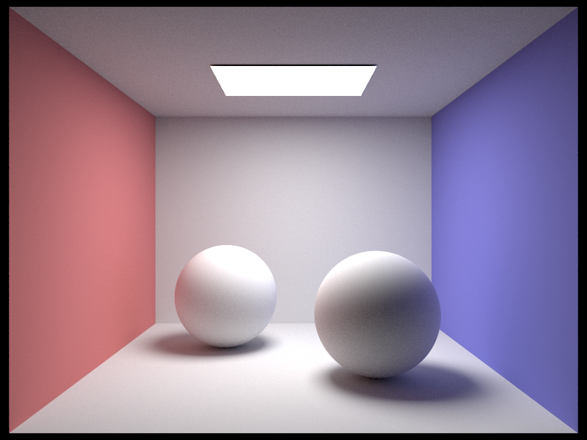

# PathTracer

## Bounding Volume Hierarchy

## Importance Sampling

runtime: 473.7629s

runtime: 679.8680s

<table style="width:100%">
<tr>
<th></th>
<th>Uniform Hemisphere Sampling</th>
<th>Importance Sampling</th>
</tr>

<tr>
<td>s=8

l=4</td>
<td></td>
<td></td>
</tr>

<tr>
<td>s=64

l=16</td>
<td></td>
<td></td>
</tr>
</table>

## Global Illumination

<table style="width:100%">
<tr>
<th>m=1</th>
<th>m=2</th>
<th>m=3</th>
</tr>

<tr>
<td></td>
<td></td>
<td></td>

<table style="width:100%">
<tr>
<th>m=4</th>
<th>m=5</th>
<th>m=32</th>
</tr>

<tr>
<td></td>
<td></td>
<td></td>
</tr>
</table>

## Adaptive Sampling

<table style="width:100%">
<tr>
<td></td>
<td></td>
</tr>
</table>

<table style="width:100%">
<tr>
<td></td>
<td></td>
<td></td>
<td></td>
</tr>
</table>

## Materials

### Diffuse

<table style="width:100%">
<tr></tr>
</table>

### Mirror & Glass

<table style="width:100%">
<tr><td></td></tr>
<tr><td></td></tr>
<tr><td></td></tr>
</table>

### Microfacet

<table style="width:100%">
<tr>
<th>gold 0.005</th>
<th>gold 0.05</th>
<th>gold 0.25</th>
</tr>
<tr>
<td></td>
<td></td>
<td></td>
</tr>
</table>

<table style="width:100%">
<tr>
<th>gold</th>
<th>silver</th>
<th>zinc</th>
<th>carbon</th>
</tr>
<tr>
<td></td>
<td></td>
<td></td>
<td></td>
</tr>
</table>

## Environment Light

<table style="width:100%">
<tr>
<td></td>
</tr>
</table>

## Depth of Field

<table style="width:100%">
<tr>
<td></td>
</tr>
</table>
